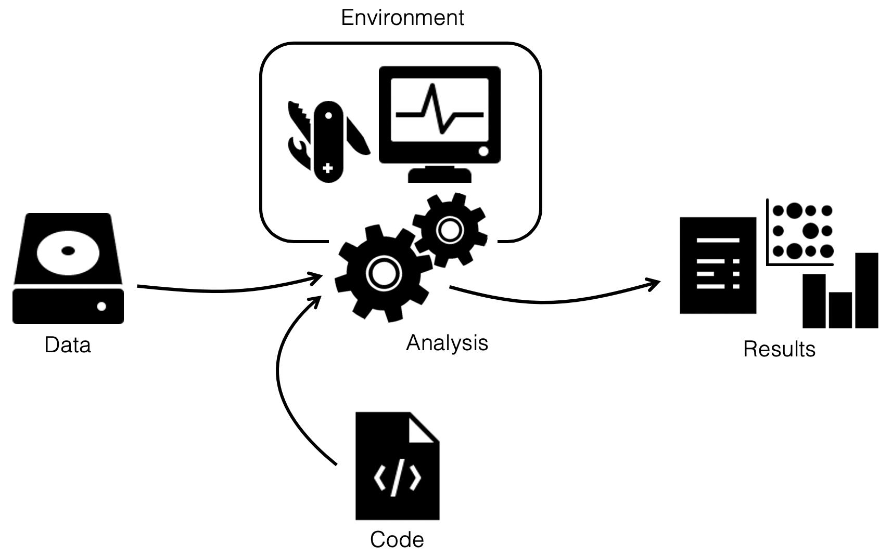

layout: true
<div class="scilife-logo"></div>
<div class="nbis-logo"></div>

---

class: center, middle

.HUGE[An Example Snakemake Workflow & Applying Tools for Reproducible Research in Snakemake]

```{r Setup, echo = FALSE, message = FALSE}
# Knitr setup
knitr::opts_chunk$set(message = FALSE,
                      warning = FALSE)

# Load packages
library("dplyr")
library("kableExtra")
```

---

# Lecture topics

* Overview of a Snakemake workflow
    * Without too much detail --> most topics will be covered more in detail in other lectures

--

* Examples how tools for reproducible research can be used in Snakemake
    * Conda
    * Singularity & Docker containers

---

# The Genome Erosion Workflow

* Compares population genomics statistics from historical and modern samples of endangered populations

---

# The Genome Erosion Workflow

* Compares population genomics statistics from historical and modern samples of endangered populations

* Data processing from fastq files to BAM & VCF files plus downstream population genomics analyses

---

# The Genome Erosion Workflow

* Compares population genomics statistics from historical and modern samples of endangered populations

* Data processing from fastq files to BAM & VCF files plus downstream population genomics analyses

* Historical and modern samples are processed in parallel

---

# The Genome Erosion Workflow

* Compares population genomics statistics from historical and modern samples of endangered populations

* Data processing from fastq files to BAM & VCF files plus downstream population genomics analyses

* Historical and modern samples are processed in parallel

* Whole-genome resequencing data from historical/ancient samples needs special processing, so some analyses or filtering steps are done separately for modern and historical samples

---

# Analysis Tracks of the Workflow

* .green[Data processing track]
    * Repeat element identification
    * Fastq file processing\*
    * Optional: mapping to mitochondrial genomes\*
    * Mapping to reference genome\*
    * BAM file processing\*
    * Optional: base quality rescaling for historical samples\*
    * Optional: subsampling to target depth\*
    * Genotyping
    * Optional: CpG site identification


\*_Steps of the workflow with different treatment of modern and historical samples_

---

# Analysis Tracks of the Workflow

* .green[BAM file track]
    * mlRho
        * Optional: analyze sex chromosomes separately
        * Optional: remove CpG sites

--

* .green[VCF file track]
    * Optional: CpG filtering
    * VCF file processing & merging per dataset
    * Optional: PCA, Runs of homozygosity (ROH), snpEff

--

* .green[GERP++ score track (optional)]
    * GERP++ score calculation from reference genome and genomes of outgroup species

---

# The Workflow Structure

* Rules with the actual analyses in separate snakefiles

--

* Snakefile
    * Python code to create sample and readgroup ID lists & dictionaries (from metadata tables and config file)
    * ”include” of rule snakefiles
    * ”all” rule collecting output files produced by the different snakefiles

--

* UPPMAX / slurm system: cluster.yaml file (! deprecated !)

--


_More about these topics later in the workshop_

---

# The workflow structure

* Metadata files (to be created by users)
    * Sample Ids, readgroup IDs, sequencing technology, paths to fastq files
    * Separate files for modern and historical samples

--

* Example `historical_samples.txt` file:

```{r Metadata structure, echo = FALSE}
# Function for creating tables
create_table <- function(data, full_width = TRUE) {
    data %>%
        kable() %>%
        kable_styling(bootstrap_options = c("basic", "hover"),
                      font_size         = 10,
                      fixed_thead       = TRUE,
                      full_width        = full_width,
                      position          = "center")
}

# Define and show metadata
metadata <- data.frame(samplename_index_lane    = c("VK01_01_L2","VK01_02_L2"),
                       readgroup_id             = c("BHYOX3ALTH.L2.01","BHYOX3ALTH.L2.02"),
                       readgroup_platform       = c(rep("illumina",2)),
                       path_to_R1_fastq         = c("data/S1/P01_2.R1.fq.gz","data/S1/P02_2.R1.fq.gz"),
                       path_to_R2_fastq         = c("data/S1/P01_2.R2.fq.gz","data/S1/P02_2.R2.fq.gz"))
create_table(metadata)
```

* The metadata tables are parsed with Python code (in the main Snakefile) to generate sample lists for the workflow

--

_Other examples for metadata tables, including the corresponding Python code, will be shown later in the workshop_

---

# The workflow structure

* Config file (to be edited by users)
    * Set different workflow steps to True or False 
        * The corresponding rules snakefiles are attached to the workflow using ”include” in the main Snakefile
    * Lists with samples for optional analyses
    * Parameters for different rules

--

```{python config file one, eval = FALSE}
#################################################################
# Configuration settings for the genome erosion workflow v2.3   #
# for ancient or historical samples, and modern samples         #

#################################################################
# 1) Full path to reference genome assembly:
ref_path: "" # reference genome has to be checked for short and concise fasta headers without special characters. File name extension can be ".fasta" or ".fa".
#################################################################


#################################################################
# 2) Relative paths (from the main snakemake directory) to metadata tables of samples.
# Example files can be found in "config/"
historical_samples: "" # leave empty ("") if not run for historical samples.
modern_samples: "" # leave empty ("") if not run for modern samples. 
#################################################################
```

---

# The workflow structure

* Config file (to be edited by users)

```{python config file two, eval = FALSE}
#################################################################
# 3) Workflow steps to be run and related parameters. 
# If a step is set to True, all previous steps it depends on will be loaded automatically.
# Only one step should be set to True at a time, results and reports should be double checked before continuing.

#################################################################
# Rules for data processing (required for downstream analyses)  #
#################################################################

#####
# Repeat element de novo prediction and repeat masking of the reference genome.
# Generates BED files of repeats and repeat-masked regions for the reference genome.
# Output files will be placed into the same directory as the reference genome fasta file (as specified above).
# That way, this step is run only once for a given reference genome.
reference_repeat_identification: False
#####


#####
# FastQC on raw reads, adapter trimming, read merging (historical samples), FastQC on trimmed reads.
fastq_processing: False

# Adapter sequences for trimming of historical samples using SeqPrep v1.1 (modified source code) (currently inserted adapter sequences from Meyer & Kircher 2010).
hist_F_adapter: "AGATCGGAAGAGCACACGTCTGAACTCCAGTCACNNNNNNNATCTCGTATGCCGTCTTCTGCTTG" # Forward read primer/adapter sequence to trim historical samples in SeqPrep v1.1 (parameter "-A")
hist_R_adapter: "AGATCGGAAGAGCGTCGTGTAGGGAAAGAGTGTAGATCTCGGTGGTCGCCGTATCATTT" # Reverse read primer/adapter sequence to trim historical samples in SeqPrep v1.1 (parameter "-B"). With double indices, include full adapter length (replacing the index by "N").
hist_F_adapter_fragment: "AGATCGGAAGAGCACACGTC" # Fragment of forward adapter sequence used to count occurrence in the first 1 million reads of fastq-files of historical samples
hist_R_adapter_fragment: "AGATCGGAAGAGCGTCGTGT" # Fragment of reverse adapter sequence used to count occurrence in the first 1 million reads of fastq-files of historical samples

# Minimum read length allowed after trimming.
# historical samples (SeqPrep v1.1 with modified source code)
hist_readlength: "30" # default setting: 30 bp

# modern samples (trim-galore)
mod_readlength: "30"
#####
```

_More examples will be shown later in the workshop_

---

# Tools for Reproducible Research Available in Snakemake

## Reproducibility is rarer than you think

The results of only 26% out of 204 randomly selected papers in the journal
*Science* could be reproduced.<sup>1</sup>

.tiny[<sup>1</sup> Stodden et. al (2018). "An empirical analysis of journal policy effectiveness for computational reproducibility". PNAS. 115 (11): 2584-2589]

--

> Many journals are revising author guidelines to include data and code
> availability.

--

> (...) an improvement over no policy, but currently insufficient for
> reproducibility.


---

# Implementing Tools for Reproducible Research in Snakemake

.center[]

--

* One aspect of reproducibility is to make sure all code is available that was used in a data analysis

--

* Track your Snakemake code with Git and make it publicly available on a GitHub or BitBucket repository to ensure that your analysis is reproducible

--

* Combining Snakemake with Conda and/or containers (such as Docker & Singularity) can make every aspect of the analysis reproducible

---

# Conda

* Is a a package, dependency, and environment manager
    - .green[packages]: any type of program (*e.g.* bowtie2, snakemake etc.)
    - .green[dependency]: other software required by a package
    - .green[environment]: a distinct collection of packages

* Keeps track of the dependencies between packages in each environment

---

# Conda

## Running a Snakemake rule with a conda environment

* Find your conda package on anaconda.org

* Create a conda environment file ("tePSI.yaml)

```{python conda env one, eval = FALSE}
name: tePSI
channels:
  - nanjiang
  - bioconda
dependencies:
  - transposonpsi=1.0.0
```

--

* Add the path to the conda environment file to your rule with the "conda:" directive
    * A good location can be a directory for environments within your main Snakemake directory

```{python conda rule, eval = FALSE}
rule transposonPSI:
    """Identify transposons in the UniProt/Swissprot protein dataset"""
    input:
        chunk = PROT_DIR + "split_result/" + PROT_NAME + "_chunk{nr}.fa"
    output:
        allHits = temp(PROT_DIR + "split_result/" + PROT_NAME + "_chunk{nr}.fa.TPSI.allHits"),
        topHits = temp(PROT_DIR + "split_result/" + PROT_NAME + "_chunk{nr}.fa.TPSI.topHits")
    params:
        dir = PROT_DIR + "split_result/"
    conda: "envs/tePSI.yaml"
    shell:
        """
        cd {params.dir}
        transposonPSI.pl {input.chunk} prot
        """
```

* This doesn't work if you use the `run` directive instead of the `shell` (or other) directives

--

* Run your workflow from the command line with the parameter `--use-conda`

---

# Conda

## Using a conda environment for the entire workflow

* Write a conda environment file that includes all tools used by the workflow (e.g. `gew.yaml`)
    * For example, if you use the `run` directive and want to specify tools & versions used by these rules

```{python conda env big, eval=FALSE}
name: gew
channels:
  - bioconda
  - conda-forge
dependencies:
  - python=3.7.6
  - snakemake=5.22.1
  - biopython=1.76
  - matplotlib=3.2.1
  - pandas=1.0.3
  - numpy=1.18.4
```

--

* Create the environment & activate it

```{bash conda create, eval=FALSE}
conda env create -f gew.yml
```

```{bash conda activate, eval=FALSE}
conda activate gew
```

--

* Start your Snakemake workflow from the command line with the activated environment
    * It is recommended to activate the environment and run the workflow in the background, using tmux or screen

---

# Docker & Singularity

* Let you run applications securely isolated in a container, packaged with all dependencies and libraries

* Can be used
    - As advanced environment managers
    - To package your code with the environment it needs
    - To package a whole workflow (*e.g.* to accompany a manuscript)
    - And much more

---

# Docker & Singularity

* Running rules with singularity containers

---

# Docker & Singularity

* Packaging your workflow in a Docker container

---