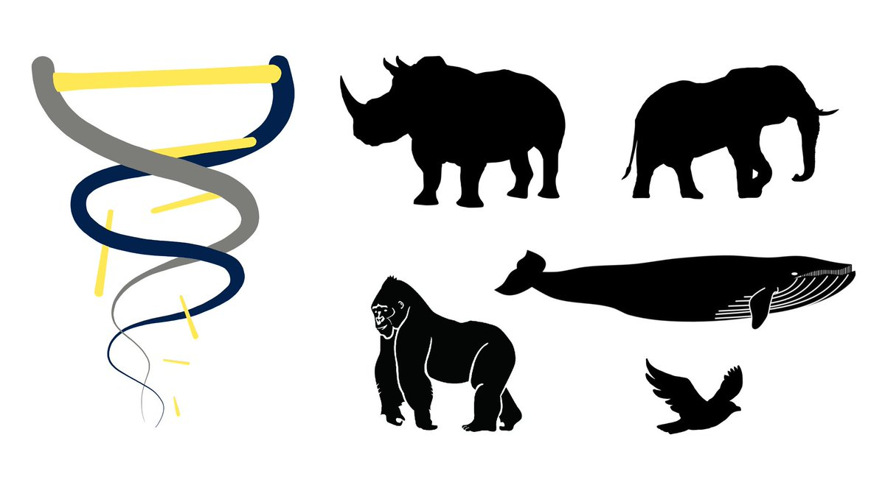
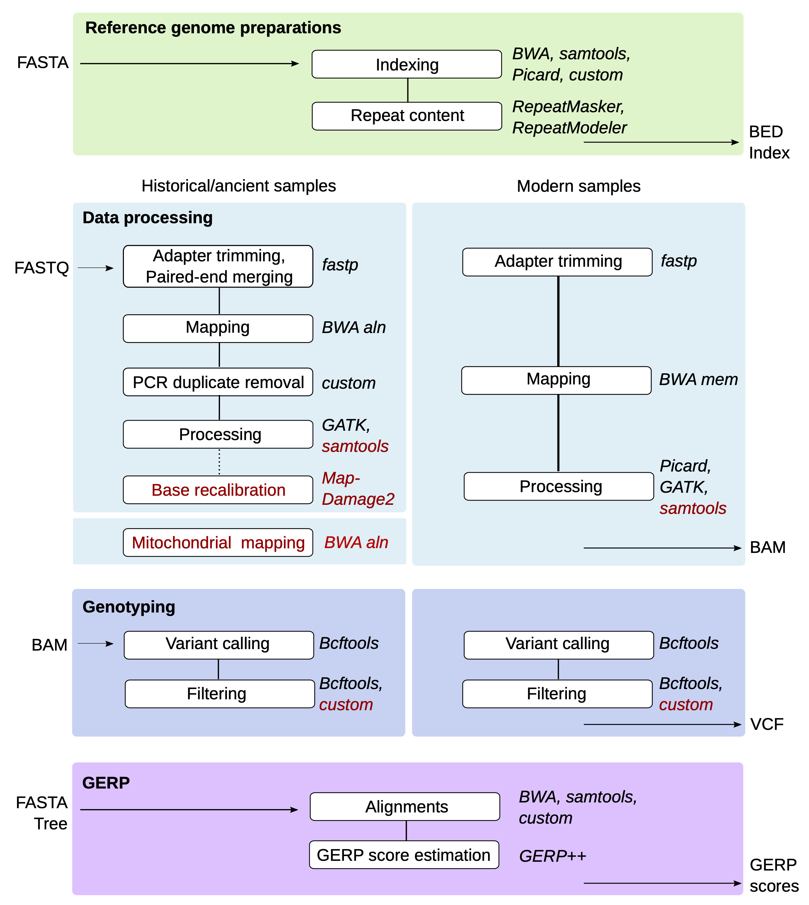
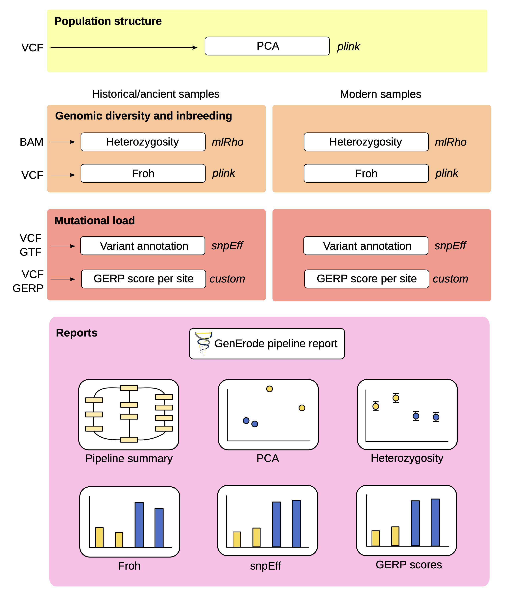

layout: true
<div class="scilife-logo"></div>
<div class="nbis-logo"></div>

---

class: center, middle

.HUGE[An Example Snakemake Workflow]


```{r Setup, echo = FALSE, message = FALSE}
# Knitr setup
knitr::opts_chunk$set(message = FALSE,
                      warning = FALSE,
                      python.reticulate = FALSE)

# Load packages
library("dplyr")
library("kableExtra")
```

---

# The GenErode pipeline

.center[]  
.center[https://github.com/NBISweden/GenErode]  
.center[[Kutschera et al. 2022 (BMC Bioinformatics)](https://bmcbioinformatics.biomedcentral.com/articles/10.1186/s12859-022-04757-0)]

---

# The GenErode pipeline

* Developed in a NBIS project with Love Dalén's lab (Centre for Palaeogenetics, SU & NRM)

--

* Compares population genomics statistics from historical and modern samples of endangered populations

.center[]
.center[.tiny[Sumatran rhinoceros (_Dicerorhinus sumatrensis_), critically endangered]]
--

* Data processing from fastq files to BAM & VCF files plus downstream population genomics analyses

---

# The GenErode pipeline

* Started at Snakemake version 3.10 (!), current pipeline runs with Snakemake version 7.20.0 (latest version: 8.11.6)

--

* Historical and modern samples are processed in parallel

--

* Whole-genome resequencing data from historical/ancient samples needs special processing as DNA degrades over time

--

* Some analyses or filtering steps are run separately for modern and historical samples, or only for historical samples

---

# Analysis Tracks of the Workflow

.center[]

---

# Analysis Tracks of the Workflow

.center[]

---

# The Workflow Structure

* Rules with the actual analyses in separate Snakefiles (in `workflow/rules/`)
    * `workflow/rules/common.smk` contains Python code to create sample and readgroup ID 
    dictionaries & lists from metadata tables and the config file


--


* `Snakefile`
    * `include` of rule Snakefiles
    * `all` rule collecting output files produced by the different rule Snakefiles
    * Python and bash code to generate and edit the pipeline report with `snakemake --report`


--

* Cluster execution with slurm (e.g. UPPMAX): 
    * `config/slurm/` folder with configuration files for the slurm profile and for 
    the deprecated cluster configuration (`--cluster-config` still exists in Snakemake v7 
    but not in v8 anymore)

---

# The Workflow Structure

* Metadata files for historical and modern samples (separately)
    * Sample IDs, readgroup IDs, sequencing technology, paths to fastq files

--

* Example `historical_samples.txt` file (whitespace-separated)

```{r Metadata structure, echo = FALSE}
# Function for creating tables
create_table <- function(data, full_width = TRUE) {
    data %>%
        kable() %>%
        kable_styling(bootstrap_options = c("basic", "hover"),
                      font_size         = 10,
                      fixed_thead       = TRUE,
                      full_width        = full_width,
                      position          = "center")
}

# Define and show metadata
metadata <- data.frame(samplename_index_lane    = c("VK01_01_L2","VK01_02_L2"),
                       readgroup_id             = c("BHYOX3ALTH.L2.01","BHYOX3ALTH.L2.02"),
                       readgroup_platform       = c(rep("illumina",2)),
                       path_to_R1_fastq         = c("data/S1/P01_2.R1.fq.gz","data/S1/P02_2.R1.fq.gz"),
                       path_to_R2_fastq         = c("data/S1/P01_2.R2.fq.gz","data/S1/P02_2.R2.fq.gz"))
create_table(metadata)
```

* see `config/historical_samples_paths.txt` and `config/modern_samples_paths.txt`

---

# The Workflow Structure

* Config file `config.yaml` (to be edited by users, placed in `config/`)
    * Paths to input data and metadata tables
    * Selection of analysis steps to be run
    * Parameters for different rules
    * Lists with samples for optional analyses

--

```{python config file data, eval = FALSE}
#################################################################
# 1) Full path to reference genome assembly.
# Reference genome has to be checked for short and concise FASTA 
# headers without special characters and has to be uncompressed. 
# The file name will be reused by the pipeline and can have the file 
# name extensions *.fasta, *.fa or *.fna.
ref_path: ""
#################################################################


#################################################################
# 2) Relative paths (from the main snakemake directory) to metadata 
# files with sample information.
# Example files can be found in "config/"
historical_samples: "" # leave empty ("") if not run for historical samples.
modern_samples: "" # leave empty ("") if not run for modern samples. 
#################################################################
```

---

# How to choose which steps to run

**Step 1**: Use booleans in the config file (`config/config.yaml`) as on/off switches

--

```{python config file start, eval = FALSE}
#####
# FastQC on raw reads, adapter and quality trimming (incl. read merging 
# for historical samples) using fastp, FastQC on trimmed reads.
# Adapter sequences are automatically detected.
# Automatic detection of NovaSeq or NextSeq samples and activation of
# poly-G tail trimming.
fastq_processing: True

[...]
#####

#####
# Map historical and modern reads to reference genome assembly (specified above).
mapping: False
#####
```

---

# How to choose which steps to run

> For many analysis steps, parameters can be specified in the config file

> These parameters can be used in the workflow with the syntax `config["parameter_name"]`,
  e.g. `config["hist_readlength"]`

--

```{python config file parameters, eval = FALSE}
#####
# FastQC on raw reads, adapter and quality trimming (incl. read merging 
# for historical samples) using fastp, FastQC on trimmed reads.
# Adapter sequences are automatically detected.
# Automatic detection of NovaSeq or NextSeq samples and activation of
# poly-G tail trimming.
fastq_processing: True

# Minimum read length.
# Historical samples (after trimming and read merging)
hist_readlength: "30" # recommended setting: 30 bp

# Modern samples (after trimming)
mod_readlength: "30"
#####
```


---

# How to choose which steps to run

**Step 2**: Use some Python code, `include` and the rule `all` to figure out what the workflow will do

--

* The main `Snakefile` contains an empty Python list `all_outputs` to collect output files from the included rule Snakefiles,

```{python Snakefile outputs list, eval = FALSE}
all_outputs = []
```

--

* the `include` variable to attach the rule Snakefiles corresponding to the analysis steps that were set to `True` in the config file, 


```{python Snakefile include, eval = FALSE}
if config["fastq_processing"]:
    include: "workflow/rules/1.1_fastq_processing.smk"
```

--

* and the rule `all` that takes the output files from the list `all_outputs` as input

```{python Snakefile all, eval = FALSE}
rule all:
    input: all_outputs,
```

---

# How to choose which steps to run

**Step 2**: Use some Python code, `include` and the rule `all` to figure out what the workflow will do

* The rule Snakefile (`workflow/rules/1.1_fastq_processing.smk`) contains some Python code to add its 
  final output files to the list `all_outputs` in the main `Snakefile`

--

```{python rules file fastq, eval = FALSE}
import os
if os.path.exists(config["historical_samples"]):
    all_outputs.append("data/raw_reads_symlinks/historical/stats/multiqc/multiqc_report.html")
    all_outputs.append("results/historical/trimming/stats/multiqc/multiqc_report.html")

if os.path.exists(config["modern_samples"]):
    all_outputs.append("data/raw_reads_symlinks/modern/stats/multiqc/multiqc_report.html")
    all_outputs.append("results/modern/trimming/stats/multiqc/multiqc_report.html")
```

--

* `config["historical_samples"]` and `config["modern_samples"]` point to the config file where the paths to metadata files are specified:

```{python config file data 2, eval = FALSE}
#################################################################
# 2) Relative paths (from the main snakemake directory) to metadata 
# files with sample information.
# Example files can be found in "config/"
historical_samples: "" # leave empty ("") if not run for historical samples.
modern_samples: "" # leave empty ("") if not run for modern samples. 
#################################################################
```

---

# How to choose which steps to run

**Step 2**: Use some Python code, `include` and the rule `all` to figure out what the workflow will do

* The rule Snakefile (`workflow/rules/1.1_fastq_processing.smk`) contains some Python code to add its 
  final output files to the list `all_outputs` in the main `Snakefile`

```{python rules file fastq 2, eval = FALSE}
import os
if os.path.exists(config["historical_samples"]):
    all_outputs.append("data/raw_reads_symlinks/historical/stats/multiqc/multiqc_report.html")
    all_outputs.append("results/historical/trimming/stats/multiqc/multiqc_report.html")

if os.path.exists(config["modern_samples"]):
    all_outputs.append("data/raw_reads_symlinks/modern/stats/multiqc/multiqc_report.html")
    all_outputs.append("results/modern/trimming/stats/multiqc/multiqc_report.html")
```

* By using the `if` statement to check for the presence of historical or modern metadata files, the workflow can also be run 
  only for historical or only for modern samples

---

class: center, middle

.HUGE[Questions?]

---
