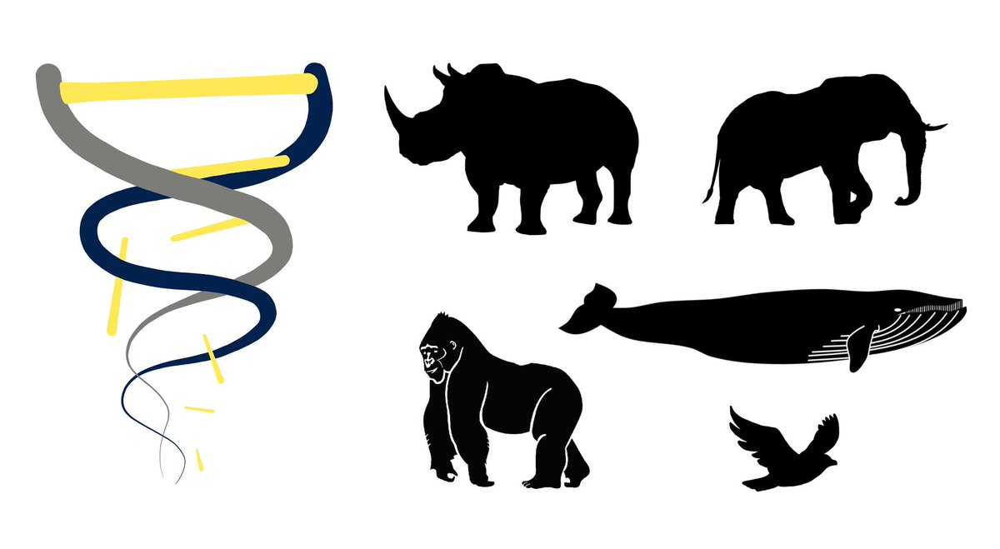
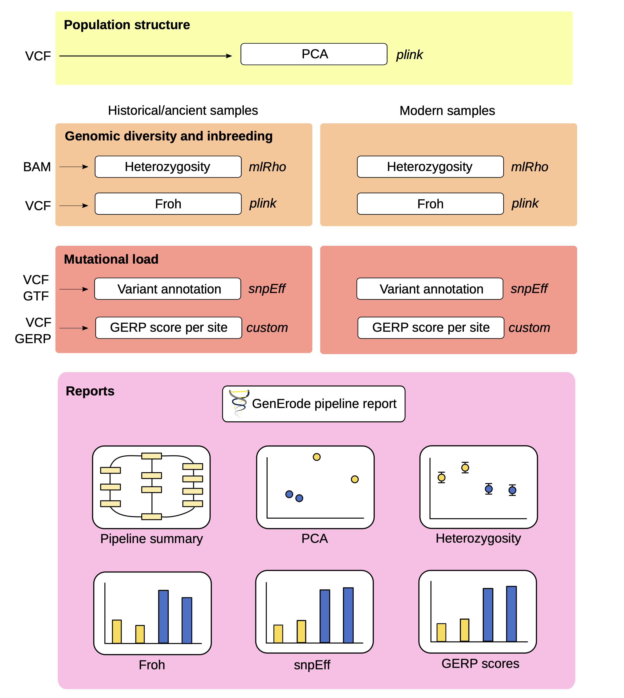

## The GenErode pipeline

{fig-align="center" width="80%"}

:::{.center}
<https://github.com/NBISweden/GenErode>

[Kutschera et al. 2022 (BMC Bioinformatics)](https://bmcbioinformatics.biomedcentral.com/articles/10.1186/s12859-022-04757-0)
:::

## The GenErode pipeline

* Developed in a NBIS project with Love Dalén's lab (Centre 
for Palaeogenetics, SU & NRM)

:::{.fragment}
* Compares population genomics statistics from historical 
and modern samples of endangered populations

::: {layout-ncol=2}
,_Lee_Kong_Chian_Natural_History_Museum,_Singapore_-_20150808_(cropped).jpg){width=150}

{width=270}
:::

* Data processing from fastq or BAM files to VCF files plus 
downstream population genomics analyses
:::

## The GenErode pipeline

* Started at Snakemake version 3.10 (!), current pipeline 
runs with Snakemake version 9.4.0

:::{.fragment}
* Historical and modern samples are processed in parallel
:::

:::{.fragment}
* Whole-genome resequencing data from historical/ancient 
samples needs special processing as DNA degrades over time
:::

:::{.fragment}
* Some analyses or filtering steps are run separately for 
modern and historical samples, or only for historical samples
:::

## Analysis Tracks of the Workflow

{fig-align="center" width="60%"}

## Analysis Tracks of the Workflow

{fig-align="center" width="60%"}

## The Workflow Structure

* Rules with the actual analyses in separate Snakefiles 
(in `workflow/rules/`)
    * `workflow/rules/common.smk` contains Python code to 
    create dictionaries & lists from metadata tables and 
    the config file 

:::{.fragment}
* `workflow/Snakefile`
    * `include` of rule Snakefiles
    * python code to collect output files from the different 
    rule Snakefiles as input for the rule `all` 
    * `all` rule that is run when executing the workflow 
    * Python and bash code to generate and edit the pipeline 
    report with `snakemake --report` 
:::

:::{.fragment}
* Cluster execution with slurm: 
    * `config/slurm/` folder with example YAML files for 
    execution with the slurm plugin 
:::

## The Workflow Structure

* Metadata files for historical and modern samples (separately)
    * Sample IDs, sequencing library IDs, lane numbers, 
    readgroup IDs, sequencing technology, paths to fastq files, 
    paths to BAM files

:::{.fragment}
* Example `historical_samples.csv` file with fastq files as input 

```{.python}
samplename,library_id,lane,readgroup_id,readgroup_platform,path_to_R1_fastq_file,path_to_R2_fastq_file,path_to_processed_bam_file
VK01,01,L2,BHYOX3ALTH.L2.01,illumina,data/P01_2.R1.fq.gz,data/P01_2.R2.fq.gz
VK01,02,L2,BHYOX3ALTH.L2.02,illumina,data/P02_2.R1.fq.gz,data/P02_2.R2.fq.gz
```
:::

## The Workflow Structure

* Config file `config.yaml` (to be edited by users, placed in `config/`)
    * Paths to input data and metadata tables
    * Selection of analysis steps to be run
    * Parameters for different rules
    * Lists with samples for optional analyses

:::{.fragment}
```{.python}
#################################################################
# 1) Full path to reference genome assembly.
# Reference genome has to be checked for short and concise FASTA 
# headers without special characters and has to be uncompressed. 
# The file name will be reused by the pipeline and can have the file 
# name extensions *.fasta, *.fa or *.fna.
ref_path: ""
#################################################################
```
:::

## The Workflow Structure

* For many analysis steps, parameters can be specified in the 
config file

:::{.fragment}
```{.python}
#####
# FastQC on raw reads, adapter and quality trimming (incl. read merging 
# for historical samples) using fastp, FastQC on trimmed reads.
# Adapter sequences are automatically detected.
# Automatic detection of NovaSeq or NextSeq samples and activation of
# poly-G tail trimming.
fastq_processing: True

# Minimum read length.
# Historical samples (after trimming and read merging)
hist_readlength: "30" # recommended setting: 30 bp

# Modern samples (after trimming)
mod_readlength: "30"
#####
```
:::

## The Workflow Structure

* These parameters are used in the workflow with the syntax 
`config["parameter_name"]`, e.g. `config["hist_readlength"]`

:::{.fragment}
```{.python}
rule fastp_historical:
    input:
        R1="data/historical/{sample}_{index}_{lane}_R1.fastq.gz",
        R2="data/historical/{sample}_{index}_{lane}_R2.fastq.gz",
    output:
        merged="results/historical/trimming/{sample}_{index}_{lane}_trimmed_merged.fastq.gz",
    params:
        readlength=config["hist_readlength"],
    shell:
        """
        fastp -i {input.R1} -I {input.R2} \
        -l {params.readlength} \
        --merged_out={output.merged} 2> {log}
        """
```
:::

## How to choose which steps to run

**Step 1**: Use booleans in the config file (`config/config.yaml`) as on/off switches

:::{.fragment}
```{.python}
#####
# FastQC on raw reads, adapter and quality trimming (incl. read merging 
# for historical samples) using fastp, FastQC on trimmed reads.
# Adapter sequences are automatically detected.
# Automatic detection of NovaSeq or NextSeq samples and activation of
# poly-G tail trimming.
fastq_processing: True

[...]
#####

#####
# Map historical and modern reads to reference genome assembly (specified above).
mapping: False
#####
```
:::

## How to choose which steps to run

**Step 2**: Add the output files from each rule Snakefile 
to a Python list 

:::{.fragment}
* e.g. `workflow/rules/1.1_fastq_processing.smk` collects 
its output files in a list called `fastq_proc_outputs` 

```{.python}
import os
# Code collecting output files from this part of the pipeline
fastq_proc_outputs=[]
if os.path.exists(config["historical_samples"]):
    fastq_proc_outputs.append("data/raw_reads_symlinks/historical/stats/multiqc/multiqc_report.html")
    fastq_proc_outputs.append("results/historical/trimming/stats/multiqc/multiqc_report.html")

if os.path.exists(config["modern_samples"]):
    fastq_proc_outputs.append("data/raw_reads_symlinks/modern/stats/multiqc/multiqc_report.html")
    fastq_proc_outputs.append("results/modern/trimming/stats/multiqc/multiqc_report.html")
```
:::

## How to choose which steps to run

**Step 2**: Add the output files from each rule Snakefile 
to a Python list 

* `config["historical_samples"]` and `config["modern_samples"]` 
point to the config file where the paths to metadata files 
are specified

:::{.fragment}
```{.python}
#################################################################
# 2) Relative paths (from the main snakemake directory) to metadata 
# files with sample information.
# The pipeline accepts FastQ files or processed BAM files as input.
# Example files can be found in "config/"
historical_samples: "config/historical_samples.csv" # leave empty ("") if not run for historical samples.
modern_samples: "" # leave empty ("") if not run for modern samples. 
#################################################################
```
:::

## How to choose which steps to run

**Step 2**: Add the output files from each rule Snakefile 
to a Python list 

* By using the `if` statement to check for the presence of 
historical or modern metadata files, the workflow can also 
be run only for historical or only for modern samples 

:::{.fragment}
```{.python}
import os
# Code collecting output files from this part of the pipeline
fastq_proc_outputs=[]
if os.path.exists(config["historical_samples"]):
    fastq_proc_outputs.append("data/raw_reads_symlinks/historical/stats/multiqc/multiqc_report.html")
    fastq_proc_outputs.append("results/historical/trimming/stats/multiqc/multiqc_report.html")

if os.path.exists(config["modern_samples"]):
    fastq_proc_outputs.append("data/raw_reads_symlinks/modern/stats/multiqc/multiqc_report.html")
    fastq_proc_outputs.append("results/modern/trimming/stats/multiqc/multiqc_report.html")
```
:::

## How to choose which steps to run

**Step 3**: Add the output files from each rule Snakefile 
as input to the rule `all`, corresponding to which analysis 
steps were set to `True` in the config file 

* The file `workflow/Snakefile` contains an empty Python list 
`all_outputs` to collect the output file lists from the rule Snakefiles, 

```{.python}
all_outputs = []
```

:::{.fragment}
* `if` clauses to append the output file lists from the rule 
Snakefiles to `all_outputs`, corresponding to which analysis 
steps were set to `True` in the config file, 

```{.python}
if config["fastq_processing"]:
    all_outputs.append(fastq_proc_outputs)
```
:::

## How to choose which steps to run

**Step 3**: Add the output files from each rule Snakefile 
as input to the rule `all`, corresponding to which analysis 
steps were set to `True` in the config file 

:::{.fragment}

* Python and Snakemake code to turn the list `all_outputs` 
into a list of file paths instead of a list of lists, and 
to remove duplicates from `all_outputs`,

```{.python}
all_outputs=flatten(all_outputs)
all_outputs=list(set(all_outputs))
```
:::

:::{.fragment}
* and the rule `all` that takes the output files from the 
list `all_outputs` as input 

```{.python}
rule all:
    input: all_outputs,
```
:::

## Questions?

{fig-align="center" width="80%"}

