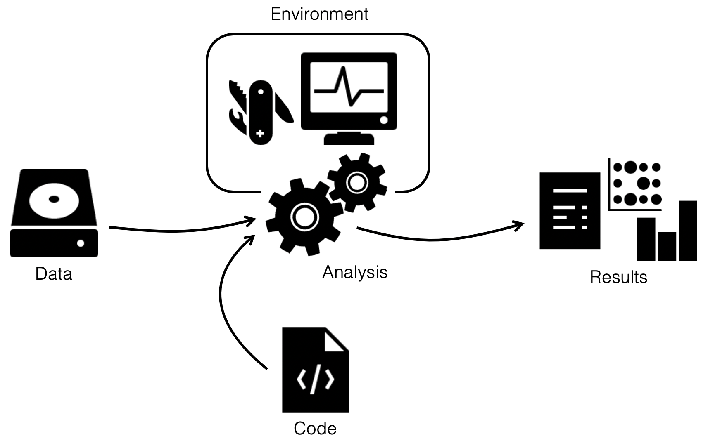

layout: true
<div class="scilife-logo"></div>
<div class="nbis-logo"></div>

---

class: center, middle

.HUGE[Combining Tools for Reproducible Research with Snakemake]

```{r Setup, echo = FALSE, message = FALSE}
# Knitr setup
knitr::opts_chunk$set(message = FALSE,
                      warning = FALSE)

# Load packages
library("dplyr")
library("kableExtra")
```

---

# Reproducibility is rarer than you think

The results of only 26% out of 204 randomly selected papers in the journal
*Science* could be reproduced.<sup>1</sup>

.tiny[<sup>1</sup> Stodden et. al (2018). "An empirical analysis of journal policy effectiveness for computational reproducibility". PNAS. 115 (11): 2584-2589]

--

> Many journals are revising author guidelines to include data and code
> availability.

--

> (...) an improvement over no policy, but currently insufficient for
> reproducibility.


---

# Combining Tools for Reproducible Research with Snakemake

.center[]

--

* Track your Snakemake code with .green[Git] and push it to a remote .green[repository] on GitHub or BitBucket to ensure that the different code versions are tracked and available

--

* Combine Snakemake with .green[Conda] and/or .green[containers] to make the compute environment and the code reproducible

--

* Integrate foreign workflow management systems such as .green[Nextflow] pipelines into your Snakemake workflow

---

# Git

* A widely used system for distributed version control to .green[version, backup and share] your code and documents

--

* Keeps a .green[complete history] of the changes you make to your files that can be re-visited & compared

--

* Git tracks .green[who contributed what] to your code

--

* Git is mainly used for .green[text files], not large or binary files, so ideal for Snakemake workflows

---

# Git

.center[]

--

1. Do some .green[coding] (*i.e.* add or change contents of files)

--

2. .green[Stage] the changes (*i.e.* specify which changes should be stored)

--

3. .green[Commit] the changes (storing them in the repository's history)

--

4. .green[Push] and .green[pull] regularly to/from your remote repository (on GitHub or Bitbucket) to collaborate, backup and share your code

---

# Conda

* Is a .green[package, dependency, and environment] manager

--

    > packages: any type of program (_e.g._ bowtie2, snakemake etc.)

    > dependency: other software required by a package

    > environment: a distinct collection of packages

--

* Keeps track of the dependencies between packages in each environment

---

# Conda

## Running a Snakemake rule with a Conda environment

--

* Make sure you have Conda installed (Miniconda or Anaconda)

--

* Find your .green[Conda package] on http://anaconda.org

--

* Create a .green[Conda environment file] (`tePSI.yaml`)

```{python conda env one, eval = FALSE}
name: tePSI
channels:
  - nanjiang
  - bioconda
dependencies:
  - transposonpsi=1.0.0
```

--

* A good location for the `yaml` file can be a directory for environments within your main Snakemake directory

--

* For reproducibility, it is important to keep track of software versions, so make sure to include package .green[versions] in your environment file

--

* .green[Git] is ideal to track changes in your Conda environment files

---

# Conda

## Running a Snakemake rule with a Conda environment

* Add the path to the Conda environment `yaml` file to your rule using the `conda` directive

--

```{python conda rule, eval = FALSE}
rule transposonPSI:
    """Identify transposons in the UniProt/Swissprot protein dataset"""
    input:
        chunk = PROT_DIR + "split_result/" + PROT_NAME + "_chunk{nr}.fa"
    output:
        allHits = temp(PROT_DIR + "split_result/" + PROT_NAME + "_chunk{nr}.fa.TPSI.allHits"),
        topHits = temp(PROT_DIR + "split_result/" + PROT_NAME + "_chunk{nr}.fa.TPSI.topHits")
    params:
        dir = PROT_DIR + "split_result/"
    conda: "envs/tePSI.yaml"
    shell:
        """
        cd {params.dir}
        transposonPSI.pl {input.chunk} prot
        """
```

--

* Start your workflow on the command line with `--use-conda`

```{bash snakemake use conda, eval=FALSE}
$ snakemake --use-conda
```

--

* This doesn't work if you use `run` instead of `shell` (or other directives)

---

# Conda

## Using a Conda environment for the entire workflow

--

* Write a .green[Conda environment file] that includes all tools used by the workflow, or those used by rules with `run` directives (e.g. `generode.yaml`)

```{python conda env big, eval=FALSE}
name: generode
channels:
  - bioconda
  - conda-forge
dependencies:
  - python=3.7.6
  - snakemake=5.22.1
  - biopython=1.76
  - matplotlib=3.2.1
  - pandas=1.0.3
  - numpy=1.18.4
```

---

# Conda

## Using a Conda environment for the entire workflow

* .green[Create] the environment

--

```{bash conda create, eval=FALSE}
$ conda env create -f generode.yml
```

--

* Use a terminal multiplexer to run the workflow in a shell instance in the background, _e.g._ .green[tmux] or .green[screen]

--

* .green[Activate] your Conda environment in the tmux or screen session

```{bash conda activate, eval=FALSE}
$ conda activate generode
```

--

* Start your Snakemake workflow

```{bash snakemake conda env, eval=FALSE}
(generode) [...] $ snakemake
```

---

# Docker & Singularity

--

## What can I use Docker for?

* Run applications securely .green[isolated] in a container, packaged with .green[all dependencies and libraries]

--

* As advanced .green[environment manager]

--

* To .green[package your code] with the environment it needs

--

* To .green[package a whole workflow] (*e.g.* to accompany a manuscript)

--

* And much more

--

## Singularity 

* Is an open source container platform suitable for .green[HPC clusters]

---

# Docker & Singularity

## Docker nomenclature

--

* A Docker .green[file] is a recipe used to build a Docker .green[image]

--

* A Docker .green[image] is a standalone executable package of software

--

* A Docker .green[container] is a standard unit of software run on the Docker Engine

--

* .green[DockerHub] is an online service for sharing docker images

--

* Docker images can be converted into Singularity images

---

# Docker & Singularity

## Running Snakemake rules with Singularity

--

* Snakemake can run a rule .green[isolated] in a container, using Singularity

--

* Each Conda package is also available as Docker and Singularity images (_e.g._ check http://biocontainers.pro for Conda packages from the bioconda channel)

--

* Many other Docker images are also available on DockerHub (https://hub.docker.com/)
    * But be aware that Docker images in free accounts are automatically deleted after a certain time of inactivity

---

# Docker & Singularity

## Running Snakemake rules with Singularity

--

* Make sure your system has Singularity installed

--

* Find your Docker or Singularity image, _e.g._ on http://biocontainers.pro

--

* Add the link to the container image (or the path to a Singularity `*.sif` file) to your rule using the `container` directive

```{python singularity rule, eval = FALSE}
rule transposonPSI:
    """Identify transposons in the UniProt/Swissprot protein dataset"""
    input:
        chunk = PROT_DIR + "split_result/" + PROT_NAME + "_chunk{nr}.fa"
    output:
        allHits = temp(PROT_DIR + "split_result/" + PROT_NAME + "_chunk{nr}.fa.TPSI.allHits"),
        topHits = temp(PROT_DIR + "split_result/" + PROT_NAME + "_chunk{nr}.fa.TPSI.topHits")
    params:
        dir = PROT_DIR + "split_result/"
    container: "docker://quay.io/biocontainers/transposonpsi:1.0.0--pl526_0"
    shell:
        """
        cd {params.dir}
        transposonPSI.pl {input.chunk} prot
        """
```

--

* Start your workflow on the command line with `--use-singularity`

```{bash snakemake use singularity, eval=FALSE}
$ snakemake --use-singularity
```

---

# Docker & Singularity

## Packaging your Snakemake workflow in a Docker container

--

* Write a .green[Docker file] (`my_workflow`), _e.g._

--

    * Start with the official Miniconda `base` image
    * Install the core packages of the workflow (_e.g._ Snakemake and dependencies such as pandas)
    * Include all rule-specific environments as separate Conda files (running your rules with Conda)
    * Include your workflow with `COPY <local-src> <container-destination>` into the Docker file
    * Include the required input data, _e.g._
        * Mount the path with the data inside the container
        * Mount a sample list, specifying their data paths

---

# Docker & Singularity

## Packaging your Snakemake workflow in a Docker container

* Create a .green[Docker image] from your Docker file (_e.g._ called `my_workflow`)

```{bash docker image, eval=FALSE}
$ docker build -t my_workflow .
```

--

* .green[Run] your container

```{bash docker run, eval=FALSE}
$ docker run --name my_first_workflow_instance -i -t my_workflow
```

--

* .green[Share] your Docker file on GitHub or BitBucket, or your Docker image on DockerHub

---

# Docker & Singularity

## Containerization of Conda based workflows

* Snakemake can .green[automatically] generate a Docker container image that contains all
  Conda environments

--

* Some advantages:
  * More .green[transparent] to understand for others than a black box container image
  * The workflow can still be .green[run without containers]
  * Testing can be done without containers, thereby limiting the number of uploads of updated images

---

# Docker & Singularity

## Containerization of Conda based workflows

* Generate a .green[Dockerfile] with `--containerize`

```{python containerize, eval = FALSE}
snakemake --containerize > Dockerfile
```

--

* This Docker image can also be used in the workflow (globally or per rule) via the directive `containerized` 

```{python containerization, eval = FALSE}
containerized: "docker://username/myTEworkflow:1.0.0"

rule transposonPSI:
    """Identify transposons in the UniProt/Swissprot protein dataset"""
    input:
        chunk = PROT_DIR + "split_result/" + PROT_NAME + "_chunk{nr}.fa"
    output:
        allHits = temp(PROT_DIR + "split_result/" + PROT_NAME + "_chunk{nr}.fa.TPSI.allHits"),
        topHits = temp(PROT_DIR + "split_result/" + PROT_NAME + "_chunk{nr}.fa.TPSI.topHits")
    params:
        dir = PROT_DIR + "split_result/"
    conda: "envs/tePSI.yaml"
    shell:
        """
        cd {params.dir}
        transposonPSI.pl {input.chunk} prot
        """
```

---

# Integrating foreign workflow management systems

* From version 6.2 on, Snakemake can run workflows written in other workflow 
  management systems such as .green[Nextflow] 

--

* The workflow is run in Snakemake until a .green[rule] to run the foreign workflow
  is reached

--

* In this rule, Snakemake .green[hands over] to the other workflow management system 
  indicated by the directive `handover`

```{python nextflow, eval = FALSE}
rule chipseq_pipeline:
    input:
        input="design.csv",
        fasta="data/genome.fasta",
        gtf="data/genome.gtf",
    output:
        "multiqc/broadPeaks/multiqc_report.html",
    params:
        pipeline="nf-core/chipseq",
        revision="1.2.1",
        profile=["conda"],
    handover: True
    wrapper:
        "0.74.0/utils/nextflow"
```

_(example from Snakemake documentation)_


---

# Integrating foreign workflow management systems

* The handover rule is run locally

--

* Submission of jobs to the cluster or cloud system is handled by the other workflow management system

--

* Afterwards, Snakemake continues running rules that use the output files of the foreign workflow

---


class: center, middle

.HUGE[Questions?]

---