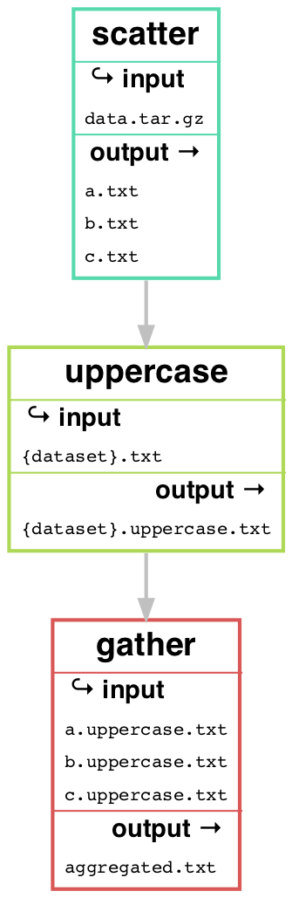

layout: true
<div class="scilife-logo"></div>
<div class="nbis-logo"></div>

---

class: center, middle

.HUGE[Scatter/gather-operations]
<br>
.HUGE[in Snakemake]

```{r Setup, echo = FALSE, message = FALSE}
# Knitr setup
knitr::opts_chunk$set(message = FALSE,
                      warning = FALSE)

# Load packages
library("dplyr")
library("kableExtra")
```

---

# What does scatter/gather mean?

--

* .green[Scatter]: turn input into several pieces of output

--

* .green[Gather]: bring together (aggregate) results from the different pieces


--

Snakemake now has built-in support for scatter/gather processes via the `scattergather` directive. Described further in the documentation: [Defining scatter-gather processes](https://snakemake.readthedocs.io/en/stable/snakefiles/rules.html#defining-scatter-gather-processes). Currently not very flexible though.

---

# When are scatter-gather processes handy?

--

- demultiplexing sequencing runs

  - multiple samples per plate
  - split plates into separate files per sample

--

- extract reads from bam files

  - reads mapped to several genomes
  - split sequences per genome

--

- parallelize analyses

  - _e.g._ multiple sequences per sample
  - split input into smaller chunks and run analyses in parallell

_etc_...

--

Between scattering and gathering there's some type of analyses performed.

---

# The basics

```python
DATASETS = ["a", "b", "c"]

rule scatter:
    output:
        expand('{dataset}.txt', dataset=DATASETS)
    input:
        data = 'data.tar.gz'
    shell:
        """
        tar xvf {input}
        """

rule uppercase:
    input:
        "{dataset}.txt"
    output:
        "{dataset}.uppercase.txt"
    shell:
        """
        tr [a-z] [A-Z] < {input} > {output}
        """

rule gather:
    output:
        "aggregated.txt"
    input:
        expand("{dataset}.uppercase.txt", dataset=DATASETS)
    shell:
        """
        cat {input} > {output}
        """
```
--

```bash
snakemake -c 1 

Job stats:
job          count    min threads    max threads
---------  -------  -------------  -------------
gather           1              1              1
scatter          1              1              1
uppercase        3              1              1
total            5              1              1
```

---

# The basics

.center[]

---

# Example: split files for parallelization

--
- one fastq file per sample
```
data
├── sample1.fastq
└── sample2.fastq
```
--
- split into several files (scatter)
```
splits
├── sample1
│   ├── sample1.1.fastq
│   ├── sample1.2.fastq
│   ├── sample1.3.fastq
|   ├── sample1.4.fastq
│   └── sample1.5.fastq
├── sample2
|   ├── sample2.1.fastq
|   ├── sample2.2.fastq
|   ├── sample2.3.fastq
|   ├── sample2.4.fastq
└   └── sample2.5.fastq
```
---
# Example: split files for parallelization

- process individual files (parallelization)
```
rc
├── sample1
│   ├── sample1.1.rc.fastq
│   ├── sample1.2.rc.fastq
│   ├── sample1.3.rc.fastq
|   ├── sample1.4.rc.fastq
│   └── sample1.5.rc.fastq
├── sample2
|   ├── sample2.1.rc.fastq
|   ├── sample2.2.rc.fastq
|   ├── sample2.3.rc.fastq
|   ├── sample2.4.rc.fastq
└   └── sample2.5.rc.fastq
```
--
- aggregate results (gather)
```
sample1.rc.fastq
sample2.rc.fastq
```

---
# Example: split files for parallelization

We start with defining the number of splits
```python
splits = 5
scatteritems = range(1, splits+1]
```

--
Then define a rule to scatter each sample fastq
```python
rule scatter:
    output:
        expand("splits/{{sample}}/{{sample}}.{scatteritem}.fastq", scatteritem = scatteritems)
    input:
        "data/{sample}.fastq"
    log:
        "logs/{sample}.scatter.log"
    conda:
        "envs/seqkit.yml"
    params:
        parts = splits,
        outdir = lambda wildcards, output: os.path.dirname(output[0])
    shell:
        """ 
        seqkit split -p {params.parts} -O {params.outdir} {input} > {log} 2>&1
        rename 's/part_0*//' {params.outdir}/{wildcards.sample}.*.fastq
        """
```

Here `scatteritem` is not a wildcard because it is expanded using the `scatteritems` list.

---
# Example: split files for parallelization

Next, a rule to do something with the split files per sample

```python
rule reversecomplement:
    output:
        "rc/{sample}/{sample}.{scatteritem}.rc.fastq"
    input:
        "splits/{sample}/{sample}.{scatteritem}.fastq"
    conda:
        "envs/seqkit.yml"
    shell:
        """
        seqkit seq --reverse --complement {input} > {output}
        """
```

Here both `scatteritem` and `sample` are wildcards. The rule is generalized to work on any value for these wildcards.

---
# Example: split files for parallelization

Then a rule to gather the results per sample

```python
rule gather:
    output:
        "{sample}.rc.fastq"
    input:
        expand("rc/{{sample}}/{{sample}}.{scatteritem}.rc.fastq", scatteritem = scatteritems)
    shell:
        "cat {input} > {output}"
```

Here `scatteritem` is not a wildcard, but `sample` is. The rule can gather split files for any sample.

---
# Example: split files for parallelization

Finally we put everything together, and define a pseudo rule 'all' that takes as input the gathered results for
all samples.

```python
samples = ["sample1", "sample2"]

splits = 5
scatteritems = range(1, splits+1)

rule all:
    input:
        expand("{sample}.rc.fastq", sample = samples)

rule scatter:
    output:
        expand("splits/{{sample}}/{{sample}}.{scatteritem}.fastq", scatteritem = scatteritems)
    input:
        "data/{sample}.fastq"

rule reversecomplement:
    output:
        "rc/{sample}/{sample}.{scatteritem}.rc.fastq"
    input:
        "splits/{sample}/{sample}.{scatteritem}.fastq"

rule gather:
    output:
        "{sample}.rc.fastq"
    input:
        expand("rc/{{sample}}/{{sample}}.{scatteritem}.rc.fastq", scatteritem = scatteritems)
```
---
# Example: split files for parallelization

```bash
snakemake -c 1 --use-conda

Building DAG of jobs...
Job stats:
job                  count    min threads    max threads
-----------------  -------  -------------  -------------
all                      1              1              1
gather                   2              1              1
reversecomplement       10              1              1
scatter                  2              1              1
total                   15              1              1
```
--

.center[]

--

This example workflow is available at the course GitHub repository: [workshop-snakemake-byoc/tree/master/lectures/scatter-gather/](https://github.com/NBISweden/workshop-snakemake-byoc/tree/master/lectures/example-workflow)

---


class: center, middle

.HUGE[Questions?]
