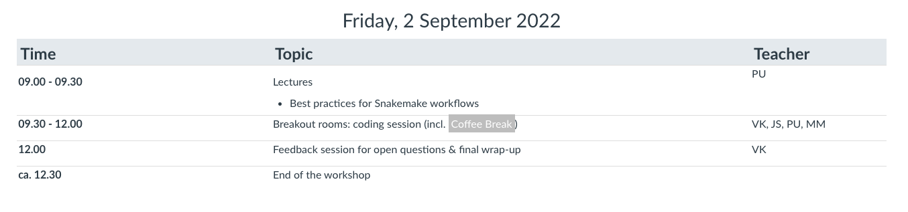

layout: true
<div class="scilife-logo"></div>
<div class="nbis-logo"></div>

---

class: center, middle

.HUGE[Welcome to the]
<br>
.HUGE[Snakemake]
<br>
.HUGE[_bring-your-own-code_]
<br>
.HUGE[Workshop]

```{r Setup, echo = FALSE, message = FALSE}
# Knitr setup
knitr::opts_chunk$set(message = FALSE,
                      warning = FALSE)

# Load packages
library("dplyr")
library("kableExtra")
```

---

# Your Instructors

.pull-left[

<br>
.small[John: instructor (group 1)]


<br>
.small[Per: instructor (group 2)]
]

.pull-right[

<br>
.small[Erik: instructor (group 3)]


<br>
.small[Verena: instructor & main organizer]
]

---

# Zoom etiquette

* Please keep your .green[webcam] on, unless you have problems with your internet connection


* .green[Lectures]
    * Please stay muted
    * If you have a question, use the raise-your-hand function (via "Participants") or write in the zoom chat


* .green[Break-out rooms]
    * Feel free to stay unmuted, unless there is a lot of background noise


---

# Slack

* Please join the Slack workspace (.green[nbissnakemakebyoc.slack.com], link in the email)

* Here we will post announcements and lecture slides (#.green[general] channel)

* You can ask snakemake questions in the #.green[snakemake-issues] channel

* If you are kicked out of zoom or have other zoom-related issues, contact us in the #.green[zoom-issues] channel

.center[]

---

# Schedule

.center[]

---

# Schedule

.center[]

---

# Schedule

.center[]

---

# Breakout room groups

Group 1:
* .green[John], Margherita, Jonas, Rashmi

Group 2:
* .green[Per], Prasoon, George, Valentina

Group 3:
* .green[Erik], Daniel, Johan, Julie

---

# Breakout room feedback session (today)

* You will be in a .green[breakout room] with your group (incl. instructor)

* Each of you .green[presents] their project to your group

* You have .green[30 minutes], incl. questions and feedback from your group

* This will hopefully help you to find a .green[starting point] to work on your project

.center[]

---

# Breakout room coding sessions (days 2 and 3)

* You will be in a .green[breakout room] with your group (incl. instructor)

* There, you will each .green[work individually] on your project

* You can .green[ask questions] whenever you need help

* Your instructor will try to .green[help], but all participants are encouraged to help each other

.center[]

---

# Feedback sessions (days 2 and 3)

* At the end of each day, after the coding sessions

* In the main zoom room

* Time to .green[discuss open questions] that were difficult to solve in the groups

.center[]

---

class: center, middle

.HUGE[Questions?]

---
