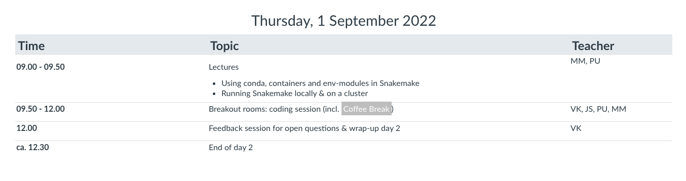

layout: true
<div class="scilife-logo"></div>
<div class="nbis-logo"></div>

---

class: center, middle

.HUGE[Welcome to the]
<br>
<br>
.HUGE[Snakemake]
<br>
.HUGE[_bring-your-own-code_]
<br>
.HUGE[Workshop]

```{r Setup, echo = FALSE, message = FALSE}
# Knitr setup
knitr::opts_chunk$set(message = FALSE,
                      warning = FALSE)

# Load packages
library("dplyr")
library("kableExtra")
```

---

# Your Instructors

.pull-left[

<br>
.small[John (instructor)]


<br>
.small[Per (instructor)]
]

.pull-right[

<br>
.small[Erik (instructor)]


<br>
.small[Verena (instructor & organizer)]
]

---

# Zoom etiquette

* Please keep your .green[webcam] on, unless you have problems with your internet connection


* .green[Lectures]
    * Please stay muted
    * If you have a question, please use the raise-your-hand function (via "Participants")
    * We will share the lecture slides with you on Canvas


* .green[Breakout rooms]
    * Feel free to stay unmuted, unless there is a lot of background noise

---

# Discussions forum

* Please use the [Discussions](https://uppsala.instructure.com/courses/52153/discussion_topics) 
  on Canvas during the workshop for communication

.center[]

---

# Discussions forum

* We will post announcements and links to lecture slides in 
  [General discussions](https://uppsala.instructure.com/courses/52153/discussion_topics/99402)

* You can ask Snakemake questions to everyone in [Snakemake questions](https://uppsala.instructure.com/courses/52153/discussion_topics/99394)

* There are also separate Discussion threads for each of the 
  groups that you can use to communicate

* If you are having problems with your Zoom connection or other Zoom-related issues, 
  you can reach us via [email](edu.byoc-snakemake@nbis.se) or in the 
  [Zoom issues](https://uppsala.instructure.com/courses/52153/discussion_topics/99406) discussion

---

# Schedule

.center[]

---

# Schedule

.center[]

---

# Schedule

.center[]

---

# Breakout room feedback session (today)

* Each of you .green[presents] their project to your group (incl. your instructor)

* You have .green[30 minutes], incl. questions and feedback from your group

* This will hopefully help you to find a .green[starting point] to work on your project

.center[]

---

# Breakout room coding sessions (days 2 and 3)

* You will be in a .green[breakout room] with your group (incl. your instructor)

* You will each .green[work individually] on your project

* You can ask your group whenever you need help or feedback

* Your instructor will try to help, but all participants are encouraged to .green[help each other]

.center[]

---

# Feedback sessions (days 2 and 3)

* At the end of each day, after the coding sessions

* In the main Zoom room

* Time to .green[discuss open questions] that were difficult to solve in 
  the groups or any .green[interesting insights] about Snakemake

.center[]

---

# Breakout room groups

Whenever we open the breakout rooms, please move yourselves into your group room 
(except for Verena's group who stays in the main room)

.green[Breakout room 1: Erik F.]
* Yueqing, Marti, Juanita, Nina

.green[Breakout room 2: John]
* Mohamed, Pol, Ymke, Dries

.green[Breakout room 3: Per]
* Tom, Erik Z., Philipp, Hanna

.green[main room: Verena]
* Nima, Andreas, Hao, Gabriel

---

class: center, middle

.HUGE[Questions?]

---
