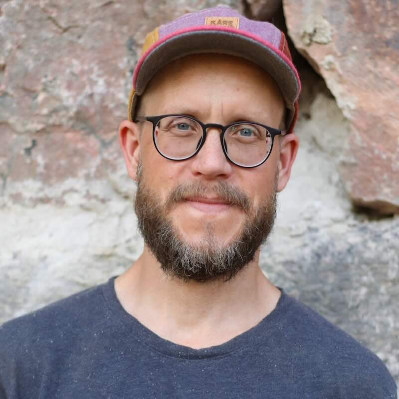
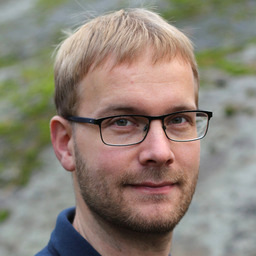
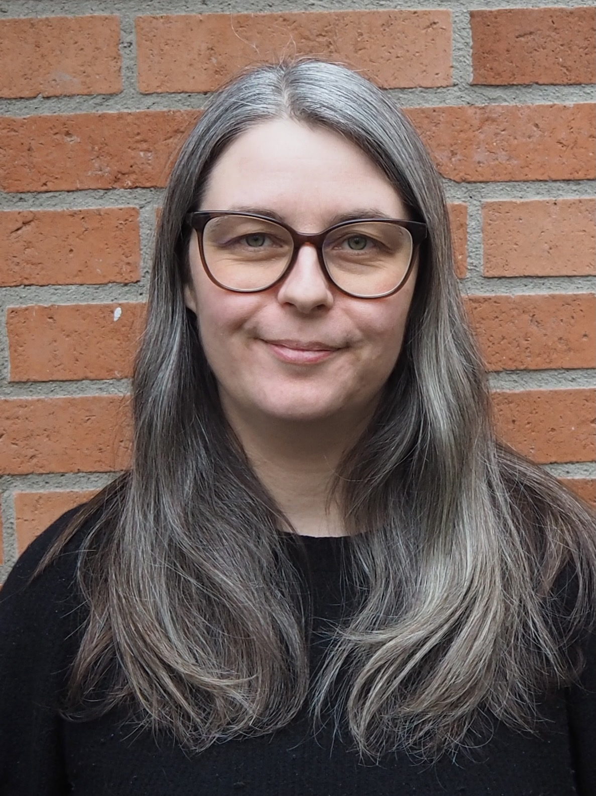

## Your teachers

:::: {.columns}
::: {.column width="50%"}
{width=150}

John Sundh

{width=125}

Per Unneberg

:::

::: {.column width="50%"}
{width=150}

Marcel Martin

{width=150}

Verena Kutschera

:::
::::

## Schedule

**Monday, 25 May**

| Time          | Topic                                         |
|---------------|-----------------------------------------------|
| 09.00 - 09.30 | Welcome and introduction                      |
| 09.30 - 10.20 | **Lectures**                                  |
|               |   - Anatomy of a Snakefile                    |
|               |   - Example workflow                          |
| 10.20 - 12.50 | **Breakout rooms** (incl. coffee break)       |
|               |   - Ice-breaker session                       |
|               |   - Feedback session                          |
|               |   - Coding session                            |
| 12.50 - 13.00 | Wrap-up day 1                                 |

## Breakout rooms

- During most of the workshop, you will be in breakout rooms
- We have placed you in **small groups** based on your replies 
in the application form
- Each group has their **own teacher**

{width=50%}

## Feedback session (today)

- You will be in a **breakout room** with your group (incl. 
your teacher)
- Each of you **presents** their project for the workshop
- You have **30 minutes**, incl. questions and feedback 
- This will hopefully help you to find a **starting point** 
to work on your pipeline 

{width=50%}

## Coding sessions (every day)

- You will be in a **breakout room** with your group (incl. 
your teacher)
- You will each **work individually** on your project
- You can ask your group whenever you need help or feedback
- Your teacher will try to help, but all participants are 
encouraged to **help each other**

{width=50%}

## Schedule

**Tuesday, 26 May**

| Time          | Topic                                         |
|---------------|-----------------------------------------------|
| 09.00 - 10.00 | **Lectures**                                  |
|               |   - Using conda and containers in Snakemake   |
|               |   - Running Snakemake locally & on a cluster  |
| 10.00 - 12.50 | **Breakout rooms** (incl. coffee break)       |
|               |   - Coding session                            |
| 12.50 - 13.00 | Wrap-up day 2                                 |

## Schedule

**Wednesday, 29 May**

| Time          | Topic                                         |
|---------------|-----------------------------------------------|
| 09.00 - 9.30  | **Lectures**                                  |
|               |   - Best practices for Snakemake workflows    |
| 10.00 - 12.50 | **Breakout rooms** (incl. coffee break)       |
|               |   - Coding session                            |
| 12.50 - 13.00 | Wrap-up day 3                                 |

## Zoom etiquette

- Please keep your webcam on 
- **Lectures** 
  - Please stay muted 
  - If you have a question, unmute and speak up 
- **Breakout rooms** 
  - Feel free to stay unmuted, unless there is a lot of 
  background noise 
- **Breaks**
  - Each group will schedule their own longer **coffee break** 
  - Feel free to take shorter breaks whenever needed 

## Slack

- Workspace **nbissnakemakebyoc.slack.com** for communication 
during the workshop 
- #general for questions or information concerning everyone 
- Separate channels to communicate within each group, e.g. 
to share code snippets and links 

## Workshop resources

- We will share the **lecture slides** with you 
- You will get a workshop **certificate** 
- We kindly ask you to fill out a **feedback form** at the 
end of the workshop 

## Breakout room groups

Whenever we open the breakout rooms, please move yourselves 
into your room: 

:::: {.columns}
::: {.column width="50%"}
| **Breakout room 1: Per**    |
|-----------------------------|
| Shengyuan                   |
| Sudip                       |
| Zoé                         |

| **Breakout room 2: Marcel** |
|-----------------------------|
| Javier                      |
| Yan                         |
| Mai                         |
| Sreeram                     |
:::

::: {.column width="50%"}
| **Breakout room 3: John**   |
|-----------------------------|
| Abrahan Hernández           |
| Gaurav                      |
| Umar                        |
| Jamie                       |
:::
::::